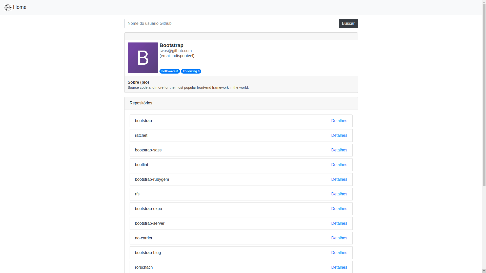

# Desafio Front-End

## **Instalação** ##

**Execução Local:**  

Para executar a aplicação localmente basta clonar este repositório pelo git:
```
git clone https://github.com/acrackintheice/desafioFrontend
```
E abrir o arquivo **<path_to_repo>/desafioFrontend/local-version/index.html** em um navegador.

**Acessar a aplicação na web:**

A aplicação foi hospedada em uma página do GithubPages e está disponvel no endereço:

https://acrackintheice.github.io/desafioFrontend/

## **Demo** ##

A imagem abaixo exibe a visualização das informaçes de um usurio do Github pela aplicação.



Para mais demos acesse a aplicação em: https://acrackintheice.github.io/desafioFrontend/

## **Notas** ##

⋅⋅* Para alterar a ordem da lista de repos foi necessário recriar (e buscar os dados para isso) os componentes pois os componentes não possuem estado.
